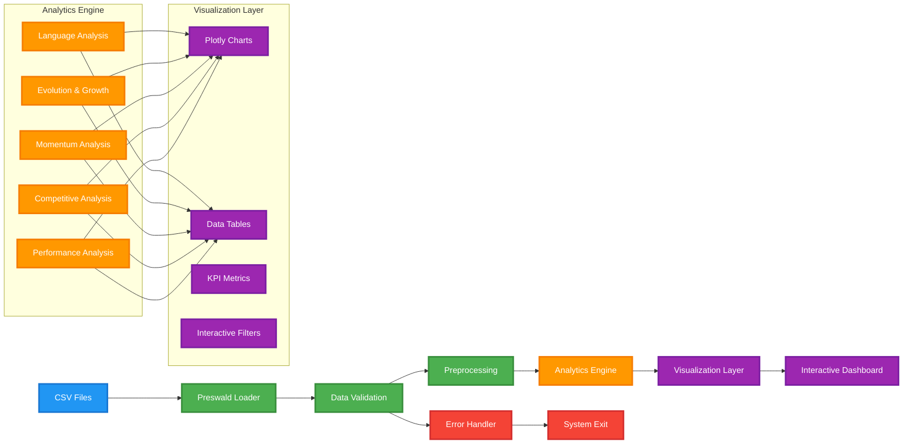

# **GitHub Programming Language Analytics Dashboard**
[](https://github.com/sailwalpranjal/github-programming-languages-analytics)
[](https://github.com/sailwalpranjal/github-programming-languages-analytics)
[](https://github.com/sailwalpranjal/github-programming-languages-analytics/issues)

---

## Project Overview

This analytics transforms GitHub repository data into comprehensive insights about programming language trends, market dynamics, and competitive intelligence. Built with Preswald, it provides analysis of language popularity, and growth patterns.

<div align="center">

### **Key Metrics Dashboard**

| Metric | Value | Description |
|--------|-------|-------------|
| **Languages Analyzed** | 150+ | Complete programming language coverage |
| **Repositories Tracked** | 8k+ | Massive dataset analysis |
| **Analysis Modules** | 3 | Custom Analysis Done |

</div>

---

## Core Features
<div align="center">
<table>
<tr>
<td width="50%">

### **Market Leadership Analysis**
- Repository count distribution
- Visualizations
- Top performer identification

### **Momentum Detection**
- Acceleration vs deceleration analysis
- Quarter-over-quarter growth tracking
- Performance consistency scoring
- Momentum category clustering

### **Performance Profiling**
- Statistical analysis
- Language stability metrics
- Volume-based categorization
- Visualization

</td>
<td width="50%">

### **Growth Pattern Recognition**
- Year-over-year trend analysis
- Absolute vs percentage growth
- Historical pattern detection

### **Competitive Intelligence**
- Domain-specific analysis
- Market share evolution
- Competitive positioning
- Strategic insights

### **Interactive Dashboards**
- Rich visualizations
- Filter and drill-down capabilities

</td>
</tr>
</table>
</td>
</div>

## Guide

### Prerequisites

```bash
pip install preswald plotly pandas numpy
```

### 📁 Project Structure

```
Github Programming Languages Analytics/
├── Github Programming Languages Analytics/
|    ├── GitHub-Programming-Languages-Analytics.py
|    ├── preswald.toml
|    ├── data/
|    │   ├── issues.csv
|    │   ├── prs.csv
|    │   └── repos.csv
|    └── images/
|        ├── github.ico
|        └── github.png
├──LICENSE
└──README.md
```

### ⚙️ Configuration Setup

Edit your `preswald.toml` configuration file:

```toml
[data_sources.issues_csv]
path = "data/issues.csv"

[data_sources.prs_csv] 
path = "data/prs.csv"

[data_sources.repos_csv]
path = "data/repos.csv"
```

### Data Requirements
#### Dataset in Github Programming Languages Analytics/data/...

### Execution

```bash
cd Github Programming Languages Analytics
preswald run
```

<div align="center">

**Running the command in the terminal will automatically start the application with visualizations!**

</div>

---

## Analytics Modules

### **1. Market Leadership Dashboard**

<div align="center">

**Objective**: Identify programming language market dominance and distribution patterns

</div>

#### Key Features:
- **Repository Count Analysis** - Absolute numbers and rankings
- **Market Share Visualization** - Percentage distribution with interactive pie charts
- **Trend Identification** - Leadership evolution over time
- **Top Performers** - Dynamic ranking system

---

### **2. Evolution & Growth Patterns**

<div align="center">

**Objective**: Track programming language evolution and identify emerging trends

</div>

#### Advanced Analytics:
- **Year-over-Year Growth** - Percentage and absolute change calculations
- **Growth Profiling** - Comparative analysis

#### Methodology:
```python
# Growth calculation formula
growth_rate = ((current_year - previous_year) / previous_year) * 100
absolute_change = current_year - previous_year
```

---

### **3. Momentum Analysis Engine**

<div align="center">

**Objective**: Detect acceleration and deceleration patterns in language development

</div>


<div align="center">
  
### Categorization
| Category | Criteria | Visual Indicator |
|----------|----------|------------------|
| **Accelerating** | Momentum > +5% | 🟢 Green |
| **Stable** | -5% ≤ Momentum ≤ +5% | 🟡 Yellow |
| **Decelerating** | Momentum < -5% | 🔴 Red |
</div>
  
#### Key Metrics:
- **Momentum Acceleration**: Recent vs. historical growth comparison
- **Growth Consistency**: Volatility-adjusted performance score
- **Development Velocity**: Activity per repository ratio

---

### **4. Competitive Market Intelligence**

<div align="center">

**Objective**: Analyze competitive dynamics within technology domains

</div>

#### Domain Classifications:
<div align="center">
<table>
<tr>
<td width="50%">

**🌐 Web Technologies**
- JavaScript, TypeScript, HTML, CSS
- React, Angular, Vue, Node.js
- PHP, Ruby, ASP.NET

**⚙️ Systems Programming**
- C, C++, Rust, Go
- Java, C#, Assembly
- Fortran, Pascal, Ada

**📊 Data Science & ML**
- Python, R, MATLAB, Julia
- SQL, SAS, Octave
- Haskell, Scala

</td>
<td width="50%">

**📱 Mobile Development**
- Swift, Kotlin, Dart
- Objective-C, Flutter
- React Native, Xamarin

**🎮 Game Development**
- C++, C#, Lua
- UnrealScript, GML
- Swift, JavaScript

**🔧 Embedded Systems**
- C, Assembly, Ada
- Arduino, VHDL, Verilog
- Embedded C++

</td>
</tr>
</table>
</div>

#### Interactive Features:
- **Domain Filtering** - Switchable technology focus areas
- **Time-Series Analysis** - Market share evolution tracking
- **Competitive Positioning** - Gaining/Stable/Losing classification

---

### **5. Performance Clustering System**

<div align="center">

**Objective**: Group languages by performance characteristics and behavior patterns

</div>
<div align="center">
  
#### Multi-Dimensional Analysis:

| Dimension | Metric | Calculation |
|-----------|---------|-------------|
| **Volume** | Total Activity | Sum of all PRs/Issues |
| **Stability** | Coefficient of Variation | (Std Dev / Mean) × 100 |
| **Growth** | Overall Trend | (Final - Initial) / Initial × 100 |
</div>


## Dashboard Elements

<div align="center">

| Visualization Type | Purpose | Interactivity |
|-------------------|---------|---------------|
| **Bar Charts** | Repository counts, rankings | Hover details, sorting |
| **Pie Charts** | Market share distribution | Slice highlighting, drilling |
| **Line Charts** | Time-series trends | Pan, filtering |
| **Scatter Plots** | Performance clustering | Bubble sizing, color coding |
| **Combo Charts** | Multi-metric comparisons | Dual axes, toggle visibility |

</div>

## Results

<div align="center">

### **System Metrics**

| KPI | Formula | Business Value |
|-----|---------|----------------|
| **Development Efficiency** | `(Total PRs / Total Issues) × 100` | Community  |
| **Market Concentration** | `Top 10 Languages Market Share` | Diversity |
| **Growth Momentum** | `Avg(Recent Growth - Historical Growth)` | Velocity |
| **Stability Index** | `100 - Avg(Coefficient of Variation)` | Maturity |

</div>

---

## 🛠️ Technical Architecture

### Data Processing Pipeline



### Technology Stack

<div align="center">

| Layer | Technology | Purpose |
|-------|------------|---------|
| **Data Layer** | CSV, Preswald | Data ingestion and management |
| **Processing** | Pandas, NumPy | Data manipulation and analysis |
| **Analytics** | Python, Statistics | Calculations and metrics |
| **Visualization** | Plotly, Interactive Charts | Dynamic visual representations |
| **Framework** | Preswald | Orchestration and execution |

</div>

---

## Documentation & Resources

### Additional Resources
- **Tools**: Preswald Framework Documentation
- **Methodology**: Statistical Analysis Principles
- **Design**: Plotly Visualization Guidelines

### Use Cases
- **Business Intelligence** - Technology investment decisions
- **Strategic Planning** - Language adoption strategies  
- **Market Research** - Competitive landscape analysis
- **Trend Analysis** - Future technology predictions

---

## 📄 License

This project is licensed under the **MIT License** - see the [LICENSE](LICENSE) file for details.

---

<div align="center">

### 🌟 **Star this repository if you find it valuable!**

---

**📧 Questions?** [Open an issue](../../issues) **•** **🐛 Found a bug?** [Report it](../../issues) **•** **💡 Have ideas?** [Share them](../../issues)

</div>
